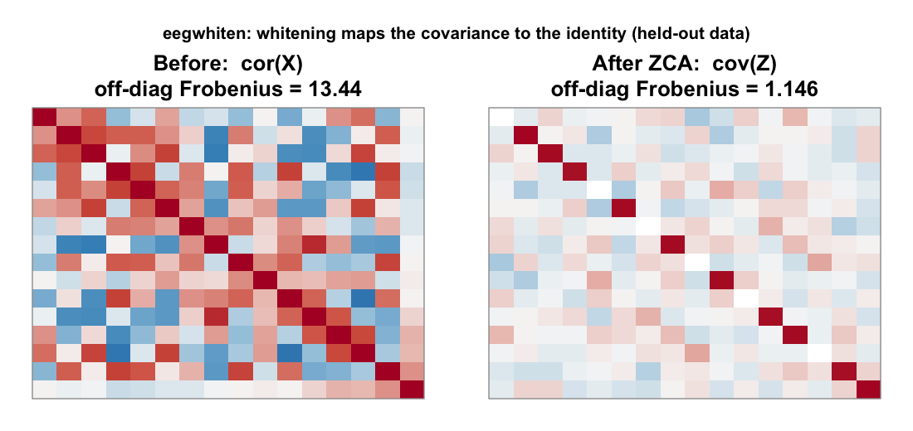
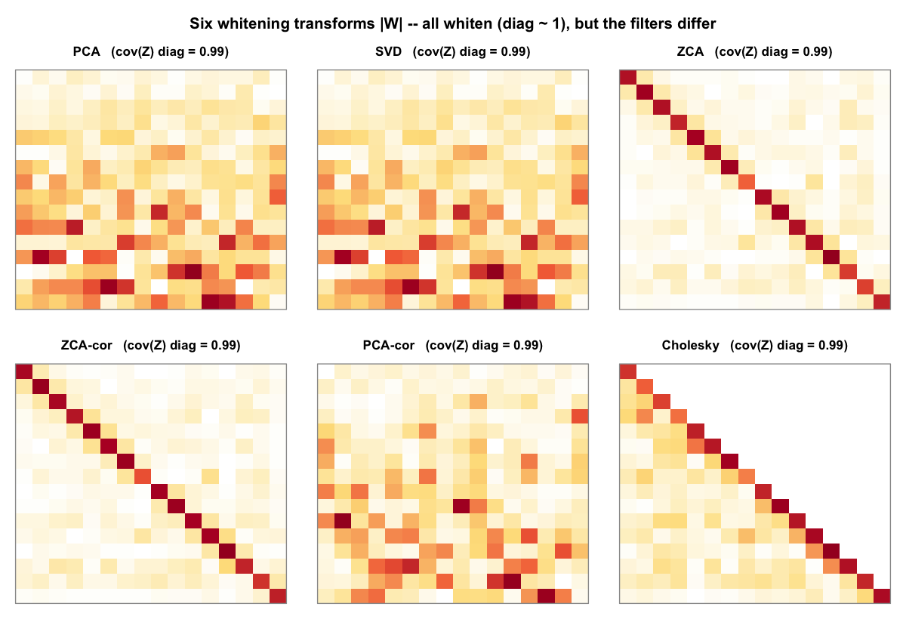
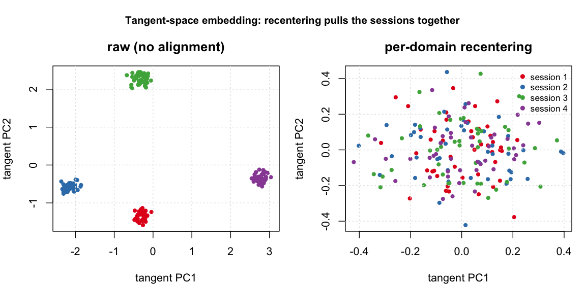
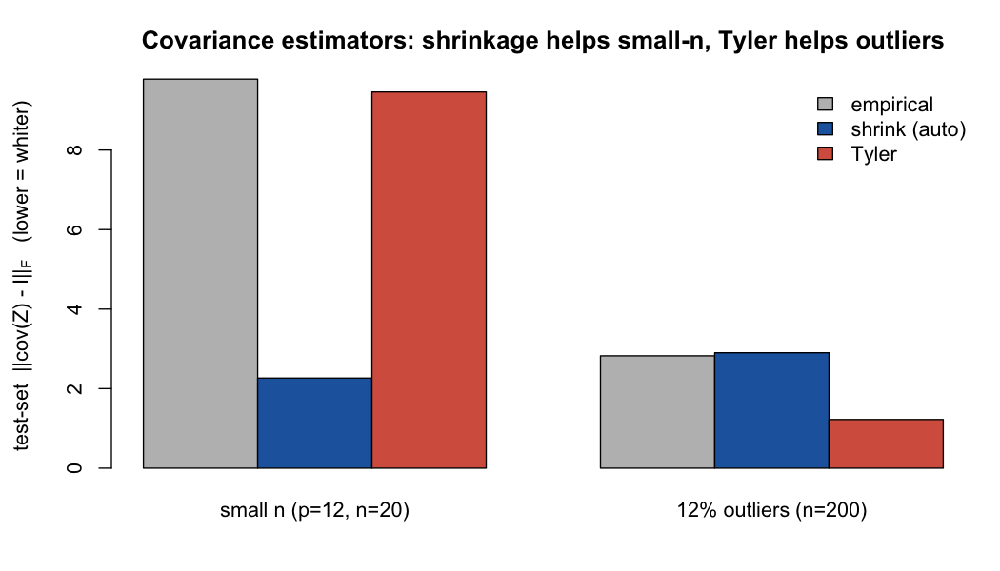

# eegwhiten

Whitening transforms for EEG and multichannel signals using a
model-based API.

`eegwhiten` provides covariance whitening methods with a train/apply
workflow: - Rows: trials/epochs/samples - Columns: channels/features -
Fit once on training data, then reuse on validation/test data - Optional
inverse transform, diagnostics, tuning, and reporting

## Why whiten? (in plain terms)

Electrodes that sit near each other pick up a lot of the same signal, so
EEG channels are usually heavily correlated, and a few channels carry
far more variance than the rest. Feed that raw data into a
distance-based method, a clustering step, ICA, or many classifiers, and
those few loud, redundant channels quietly take over. “Distance” ends up
meaning something different in every direction.

Whitening is a single linear transform that fixes both problems at once.
It rescales every direction to the same variance and removes the
correlation between channels. Picture the data as a stretched, tilted
cloud of points; whitening turns it into a round ball of unit size,
where every direction counts equally and the channels no longer track
each other. In numbers, the covariance becomes the identity matrix (that
is the before-and-after picture in the gallery below).

Why that helps:

- **Distances and linear models stop being skewed.** Whitening is the
  same operation as switching from plain Euclidean distance to
  Mahalanobis distance, which accounts for scale and correlation.
  Nearest-centroid, k-means, k-NN, and linear classifiers all behave
  better on whitened features.
- **It is the standard first step for ICA, CSP, and Riemannian
  pipelines,** which assume equal-variance, decorrelated inputs.
- **It helps models carry over between sessions and subjects.** Every
  recording has its own electrode contact, noise, and montage, which
  shows up as a differently shaped covariance. Whitening each recording
  onto a common footing removes much of that nuisance difference, so a
  model trained today still works on tomorrow’s session (the alignment
  figure below shows this).
- **It keeps the numbers stable.** Decorrelated, equal-scale features
  are easier for the linear algebra and the optimizers that come next.

Put simply: whitening clears away the redundant structure (scale and
correlation) so the patterns you actually care about, and whatever you
run next, get a fair and stable start.

## Features

- Multiple whitening methods: `PCA`, `PCA-cor`, `ZCA`, `ZCA-cor`, `SVD`,
  `Cholesky`
- Shrinkage regularization with manual `lambda` or `lambda = "auto"`
  (`oas`/`lw`)
- Shrinkage targets: scaled identity or `diagonal` (preserves channel
  variances)
- Dimensionality reduction via `n_comp` or `var_threshold`
- Weighted fitting with `sample_weight`; non-finite handling via
  `na_action`
- Robust covariance estimation: `empirical`, `tyler`, `mcd` (requires
  `robustbase`)
- Incremental updates with optional exponential forgetting:
  `whiten_model_update(..., decay)`
- Batch modes: independent, shared model, EA alignment, and per-domain
  `recenter`
- Cross-session helpers:
  [`recenter()`](https://yiming-s.github.io/eegwhiten/reference/recenter.md),
  and `predict(..., self_center = TRUE)`
- Riemannian pipeline:
  [`epoch_covariances()`](https://yiming-s.github.io/eegwhiten/reference/epoch_covariances.md),
  [`tangent_space()`](https://yiming-s.github.io/eegwhiten/reference/tangent_space.md),
  [`untangent_space()`](https://yiming-s.github.io/eegwhiten/reference/untangent_space.md)
- Relative / generalized-eigenvalue whitening (CSP/xDAWN-style):
  [`whiten_relative()`](https://yiming-s.github.io/eegwhiten/reference/whiten_relative.md)
- Spatial filters and forward patterns:
  [`whitening_patterns()`](https://yiming-s.github.io/eegwhiten/reference/whitening_patterns.md)
- Automatic hyperparameter tuning with an analytic fast path:
  [`auto_tune_whitening()`](https://yiming-s.github.io/eegwhiten/reference/auto_tune_whitening.md)
- One-click markdown report:
  [`report_whitening()`](https://yiming-s.github.io/eegwhiten/reference/report_whitening.md)

## At a glance

Whitening maps the covariance to the identity (shown on held-out data),
and the six methods achieve it with visibly different transforms:



Whitening before and after



Six whitening transforms

For cross-session / cross-subject data, per-domain recentering pulls the
sessions together in the Riemannian tangent space:



Tangent-space embedding

Shrinkage and robust covariance estimators keep whitening stable when
the sample is small or contaminated:



Covariance estimators

All figures are reproducible with `Rscript tools/make-figures.R`.

## Installation

``` r

# install.packages("devtools")
devtools::install_github("Yiming-S/eegwhiten")
```

For local development:

``` r

# install.packages("pkgload")
pkgload::load_all(".")
```

## Quick Start

``` r

library(eegwhiten)
set.seed(42)

X_train <- matrix(rnorm(300 * 16), 300, 16)
X_test  <- matrix(rnorm(120 * 16), 120, 16)
colnames(X_train) <- paste0("Ch", 1:16)
colnames(X_test)  <- colnames(X_train)

# Fit whitening model on training data
m <- whiten_model(
  X_train,
  method = "PCA",
  var_threshold = 0.95,
  lambda = "auto",
  lambda_method = "oas"
)

# Apply to new data
Z_test <- predict(m, X_test)

# Diagnostics
diag <- check_whitening(Z_test)
diag$diag_mean

# Inverse transform (approximate if reduced)
X_test_rec <- unwhiten(m, Z_test)
```

## Core APIs

### 1) One-shot whitening

``` r

res <- whiten_matrix(X_train, method = "ZCA", lambda = 0.1)
Z <- res$Z
```

### 2) Fit/transform workflow

``` r

m <- whiten_model(X_train, method = "PCA", n_comp = 8, lambda = 0.05)
Z_train <- predict(m, X_train)
Z_test <- predict(m, X_test)
```

### 3) Incremental update without full refit

``` r

X_new <- matrix(rnorm(80 * 16), 80, 16)
m <- whiten_model_update(m, X_new)
```

## Advanced Usage

### Weighted fitting + robust covariance

``` r

w <- rexp(nrow(X_train), rate = 1) + 0.1

m_w <- whiten_model(
  X_train,
  method = "ZCA",
  lambda = 0.1,
  sample_weight = w,
  cov_estimator = "empirical"
)

m_tyler <- whiten_model(
  X_train,
  method = "ZCA",
  lambda = 0,
  cov_estimator = "tyler"
)

# Requires robustbase
# m_mcd <- whiten_model(X_train, method = "ZCA", cov_estimator = "mcd", lambda = 0)
```

### Automatic tuning

``` r

tuned <- auto_tune_whitening(
  X_train,
  methods = c("PCA", "ZCA", "PCA-cor"),
  n_comp_grid = c(6, 8, 10),
  lambda_grid = list("auto", 0.05, 0.1),
  cv_folds = 5,
  scoring = "unsupervised",
  seed = 123
)

best_model <- tuned$best_model
head(tuned$ranking)
```

### Batch whitening

``` r

X_list <- list(
  matrix(rnorm(200 * 16), 200, 16),
  matrix(rnorm(180 * 16), 180, 16),
  matrix(rnorm(220 * 16), 220, 16)
)

# Independent per matrix
out_ind <- whiten_batch(X_list, mode = "independent", method = "PCA", n_comp = 8)

# Shared model from first matrix
out_shared <- whiten_batch(X_list, mode = "shared_model", method = "PCA", n_comp = 8)

# EA alignment mode
out_ea <- whiten_batch(X_list, mode = "ea", ea_mean = "logeuclid")
```

### Euclidean Alignment (EA) model API

``` r

ea <- euclidean_alignment(X_list, input = "raw", mean_method = "logeuclid")
Z1 <- predict(ea$model, X_list[[1]])
X1_back <- inverse_ea(ea$model, Z1)
```

### Cross-session recentering (per-domain alignment)

[`recenter()`](https://yiming-s.github.io/eegwhiten/reference/recenter.md)
aligns each session/subject by its *own* covariance, mapping every
domain to the identity. Unlike
[`euclidean_alignment()`](https://yiming-s.github.io/eegwhiten/reference/euclidean_alignment.md)
(a single shared transform from the grand-mean covariance), this removes
between-session shift the way Euclidean Alignment (He & Wu, 2019) is
meant to.

``` r

X_list <- list(
  matrix(rnorm(200 * 16), 200, 16),
  matrix(rnorm(180 * 16), 180, 16)
)

# Each domain whitened to identity, independently
out <- whiten_batch(X_list, mode = "recenter")

# Single matrix
rc <- recenter(X_list[[1]])

# At predict time, center test data on its own mean (drift-robust)
m <- whiten_model(X_list[[1]], method = "ZCA", lambda = 0.1)
Z_test <- predict(m, X_list[[2]], self_center = TRUE)
```

### Riemannian tangent space

Project per-trial SPD covariances to the tangent space at a reference
mean and vectorize them for a downstream linear classifier — the
standard Riemannian BCI pipeline.

``` r

X_tensor <- array(rnorm(40 * 8 * 128), dim = c(40, 8, 128))
covs <- epoch_covariances(X_tensor, lambda = 0.05)
V <- tangent_space(covs, mean_method = "riemann")  # [40 x p(p+1)/2]
covs_rec <- untangent_space(V)                     # inverse map
```

### Relative / generalized-eigenvalue whitening

Whiten one covariance by another (e.g. signal vs. noise), the basis of
CSP and xDAWN.

``` r

X <- matrix(rnorm(200 * 8), 200, 8)
Sigma_signal <- cov(X)
Sigma_noise  <- cov(matrix(rnorm(200 * 8), 200, 8))

res <- whiten_relative(Sigma_signal, reference = Sigma_noise, n_comp = 6)
Z <- X %*% t(res$W)   # res$values are the per-component variance ratios
```

### Online updates with forgetting

``` r

X_stream_1 <- matrix(rnorm(200 * 16), 200, 16)
X_stream_2 <- matrix(rnorm(200 * 16), 200, 16)

m <- whiten_model(X_stream_1, method = "ZCA", lambda = 0.05)
# decay < 1 down-weights past data to track non-stationary drift
m <- whiten_model_update(m, X_stream_2, decay = 0.9)
```

## Tensor Data (trial × channel × time)

``` r

X_tensor <- array(rnorm(20 * 8 * 100), dim = c(20, 8, 100))

m_t <- whiten_model_tensor(X_tensor, method = "ZCA", lambda = 0)
Z_tensor <- predict_tensor(m_t, X_tensor)
X_tensor_rec <- unwhiten_tensor(m_t, Z_tensor)
```

## Reporting

Generate a markdown report for one model or a tuning result.

``` r

# Model report
report_whitening(m, data = X_train, file = "whitening-report.md")

# Tuning report (includes ranking table)
report_whitening(tuned, data = X_train, file = "whitening-tuned-report.md")
```

## Testing

Run testthat tests:

``` r

testthat::test_dir("tests/testthat")
```

Generate test report markdown:

``` r
Rscript tests/generate-test-report.R --output tests/test-report.md
```

## Notes

- `lambda = "auto"` currently supports `cov_estimator = "empirical"`.
- [`whiten_model_update()`](https://yiming-s.github.io/eegwhiten/reference/whiten_model_update.md)
  currently supports models using empirical covariance moments.
- `mcd` estimator requires package `robustbase`.
- For train/test workflows, avoid fitting whitening independently on
  train and test matrices.

## License

MIT
